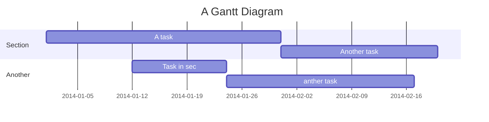

###### tags: `README` `計畫起源與時程` `使用說明` `FAQ`

# README

最後更新時間: 2020-06-17 (以github為準)

## 計畫起源

跑離校實在太痛苦了。  
好不容易寫完論文，還有一堆格式要處理。  

不是阿~網路上的資料怎麼都不全，到底哪些是對的，查到的說明怎麼是多年前的，學校可不可以說清楚...  

:::danger
**教授!! 我只是想畢業阿~**
:::spoiler 迷之音
讓我畢業啦~&@^*&@$*%)(
:::

---

## 使用者回報機制

```sequence
Alice->Bob: Hello Bob, how are you?
Note right of Bob: Bob thinks
Bob-->Alice: I am good thanks!
Note left of Alice: Alice responds
Alice->Bob: Where have you been?
```

---

## Project Timeline



---

## Appendix and FAQ

:::info
**Find this document incomplete?** Leave a comment!
:::

