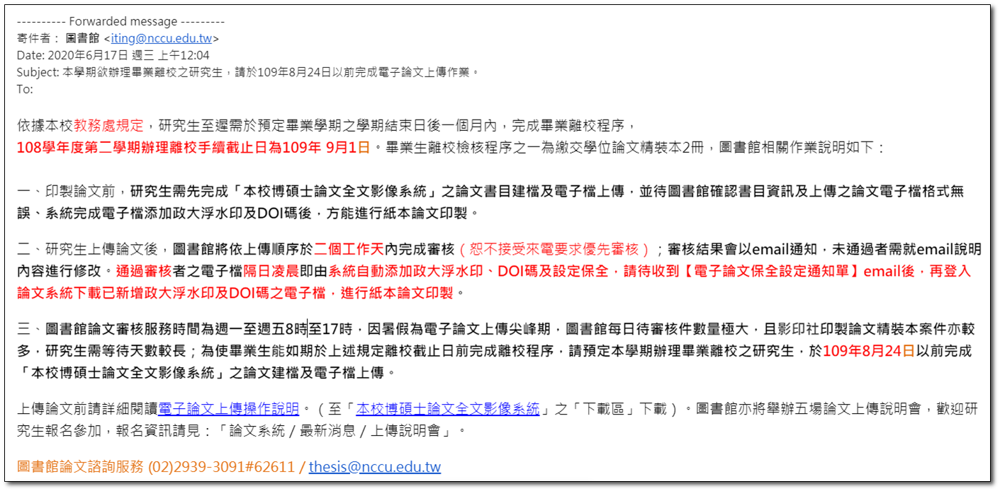



# 重要時程

如有錯誤，請協助[即時回饋]，本手冊按三餐維護更新(笑~)

以下為 108學年度 碩士畢業生(即2020-06畢業的學生)，一些重要的時程。  
詳細資訊以政治大學 - 圖書館、教務處 的公告為準。

---

## 時程重點

:::danger

* 論文上傳 [國立政治大學博碩士論文全文影像系統](http://thesis.lib.nccu.edu.tw/cgi-bin/gs32/gsweb.cgi/login?o=dwebmge) 審核需要**2**天

* 印製論文所需時間，依照各影印店有所差異，請參考《裝訂論文》章節。

:::

|時程|事項|
|---|---|
|07.02-07.03|**學士班**畢業生集中畢業離校辦理 (編: 雖與碩士生無關，但這兩天行政可能較忙)|
|08.24|論文全文影像建檔|
|09.01|辦理離校手續截止日|

---

## 資料來源

**圖書館:**

* [國立政治大學 圖書館 - 畢業離校及論文繳交](https://www.lib.nccu.edu.tw/zh_tw/service/207)

**教務處:**

* [辦理碩、博士班學生領取學位證書作業流程](https://aca.nccu.edu.tw/download/flowProcess/file/register/register34.pdf)
* [政治大學教務處 - 學士班畢業離校](https://aca.nccu.edu.tw/zh//index.php?option=com_content&view=article&id=4868)

**學校信件:**

