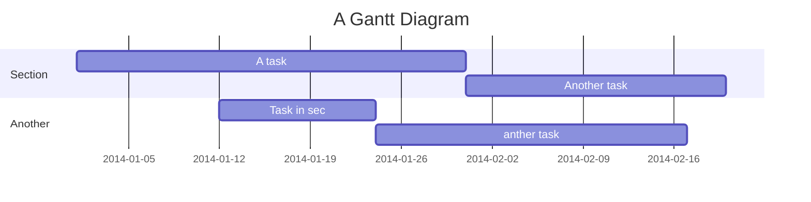

###### tags: `README` `計畫起源與時程` `使用說明` `FAQ`

# README

最後更新時間: 2020-06-17 (以github為準)

## 計畫起源

以為寫完論文，等待我的是美好的明天，  
結果還有一堆事情需要處理...  

* 論文格式
    * 上下左右邊框、引用、字型、字體  
    * 封面
    * 目錄
* 寫信邀請老師
* 口試推薦餐點
* 裝訂論文推薦
* 跑離校RPG

天啊實在太痛苦了。  
就算網路找資料有些也不全面，哪些是對的?這麼早年份的規定沒問題嗎?  

是的這個計畫就是在這樣的痛苦中形成XDD~  
當然後面還有很多離奇曲折的故事，或是省略了很多問候語XDD~

網路上的資料怎麼都不全，到底哪些是對的，查到的說明怎麼是多年前的，學校可不可以說清楚...  

:::danger
**教授!! 我只是想畢業阿~**


\讓我畢業啦/\讓我畢業啦/\讓我畢業啦/ (翻桌)
:::
:::spoiler 翻譯蒟蒻
---

## 使用者回報機制

```sequence
Alice->Bob: Hello Bob, how are you?
Note right of Bob: Bob thinks
Bob-->Alice: I am good thanks!
Note left of Alice: Alice responds
Alice->Bob: Where have you been?
```

---

## Project Timeline



---

## Appendix and FAQ

:::info
**Find this document incomplete?** Leave a comment!
:::

